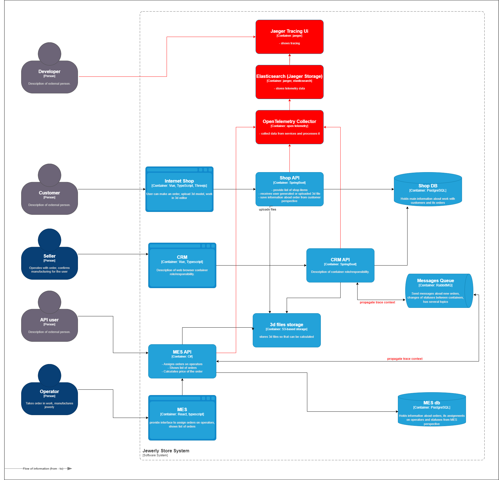
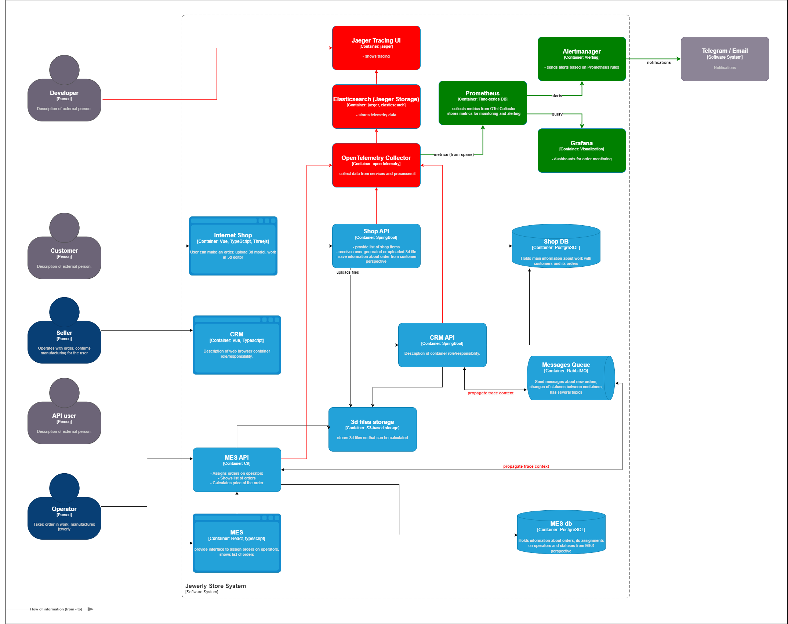
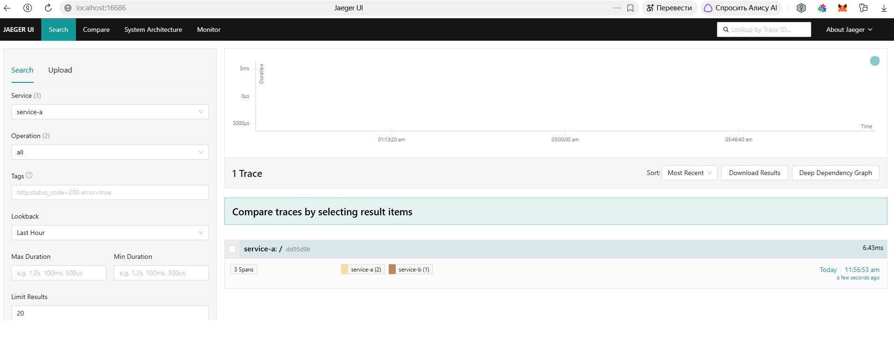
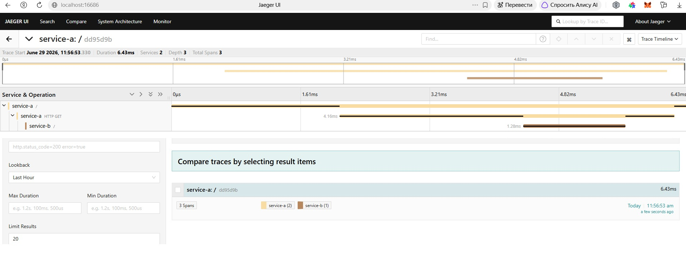

# Задание 3. Трейсинг

## Мотивация

В компании «Александрит» заказы часто «зависают» или теряются на разных этапах жизненного цикла. Без сквозного трейсинга невозможно понять, где именно происходит сбой: на стороне онлайн-магазина, CRM, MES или в RabbitMQ. Внедрение распределённого трейсинга позволит:

- Восстанавливать полную картину прохождения заказа – от создания до закрытия.
- Обнаруживать узкие места – например, долгий расчёт стоимости или зависшие сообщения.
- Ускорять диагностику инцидентов – вместо ручного анализа логов разных систем инженер видит один трейс с временными метками.
- Контролировать SLA – измерять время выполнения каждого этапа и сравнивать с нормативами.
- Автоматически выявлять аномалии – например, заказ, застрявший в статусе MANUFACTURING_APPROVED дольше недели.

Влияние на бизнес-метрики:

| Метрика                               | Как изменится | Почему                                                 |
|---------------------------------------|---------------|--------------------------------------------------------|
| Среднее время восстановления (MTTR)   | Сократится    | Инженеры сразу видят, в каком сервисе произошла ошибка |
| Среднее время отклика (Latency)       | Улучшится     | Выявляем и оптимизируем самые медленные операции       |
| Количество ошибок (Errors)            | Снизится      | Быстрая диагностика и исправление ошибок на проде      |
| Конверсия заказов                     | Повысится     | Меньше сбоев и задержек → меньше отказов клиентов      |
| Скорость выпуска релизов              | Увеличится    | Разработчики тратят меньше времени на анализ ошибок    |
| Удовлетворённость клиентов (CSAT/NPS) | Повысится     | Стабильная работа и прозрачность заказов               |

## Анализ точек отказа

Чтобы понять, где именно нужен трейсинг, выделим критические переходы заказа и возможные проблемы на каждом этапе:

| Переход                                         | Где может сломаться                                               | Как увидим в трейсинге                                   |
|-------------------------------------------------|-------------------------------------------------------------------|----------------------------------------------------------|
| INITIATED → FILE_UPLOADED                       | Сбой загрузки 3D‑файла в S3, таймаут на стороне клиента           | Спан UploadToS3 с error=true или отсутствие спана        |
| FILE_UPLOADED → SUBMITTED                       | Сбой валидации модели, таймаут при сохранении                     | Спан ValidateOrder с ошибкой                             |
| SUBMITTED → PRICE_CALCULATED                    | Сообщение потеряно в RabbitMQ, MES не получил заказ               | Есть спан Publish, но нет спана Consume                  |
| PRICE_CALCULATED → MANUFACTURING_APPROVED       | Продавец не подтвердил заказ, CRM не получил сообщение            | Длительность между спанами > N дней                      |
| MANUFACTURING_APPROVED → MANUFACTURING_STARTED  | Оператор не взял заказ в работу                                   | Длительность спана > SLA                                 |
| MANUFACTURING_STARTED → MANUFACTURING_COMPLETED | Оператор завис, сбой при обновлении статуса                       | Длительность > норматива или отсутствие финального спана |
| MANUFACTURING_COMPLETED → PACKAGING → SHIPPED   | Сбой обновления статуса                                           | Отсутствие спанов на этих этапах                         |
| SHIPPED → CLOSED                                | Транспортная компания не прислала webhook, CRM не закрыла вручную | Длительность > N дней                                    |

Сервисы, которые покрываем трейсингом:
- Shop API (Java Spring Boot)
- CRM API (Java Spring Boot)
- MES API (C#)
- RabbitMQ (пропагация контекста через заголовки)
- PostgreSQL (JDBC-инструментация)
- S3-хранилище (вызовы SDK)

## Данные, попадающие в трейсинг

Каждый спан (span) должен содержать:

| Поле              | Описание                                                | Пример                           |
|-------------------|---------------------------------------------------------|----------------------------------|
| Trace ID          | Уникальный идентификатор трейса для всего запроса       | a1b2c3d4e5f6                     |
| Span ID           | Уникальный идентификатор шага                           | span-001                         |
| Parent Span ID    | Ссылка на родительский спан                             | span-000                         |
| Service Name      | Имя сервиса, где выполняется операция                   | shop-api                         |
| Operation Name    | Название операции (эндпоинт, метод)                     | POST /orders                     |
| Start Timestamp   | Время начала операции                                   | 2025-01-01T12:00:00Z             |
| Duration          | Длительность в миллисекундах                            | 350                              |
| Tags / Attributes | Дополнительные метаданные:                              |                                  |
|                   | order_id                                                | ID заказа                        |
|                   | customer_id                                             | ID клиента                       |
|                   | status_code                                             | HTTP статус                      |
|                   | error                                                   | true/false                       |
|                   | queue_name                                              | Имя очереди RabbitMQ             |
|                   | message_id                                              | ID сообщения                     |
|                   | polygon_count                                           | Количество полигонов для расчёта |
| Logs / Events     | События внутри спана (запросы к БД, вызовы внешних API) | "SQL query executed"             |

## Предлагаемое решение

### 1. Инструменты и компоненты

- OpenTelemetry (OTel) – стандарт для сбора телеметрии (трейсы, метрики, логи) с поддержкой Java, C#, Python. Будет использован OTel SDK для инструментации приложений.
- Jaeger – бэкенд для сбора, хранения и визуализации трейсов. Развёртывается на отдельном EC2-инстансе (или нескольких для отказоустойчивости). OTel Collector размещается как процесс на каждом EC2-инстансе приложения (Shop API, CRM API, MES API).
- Elasticsearch – хранилище для долгосрочного хранения трейсов (доступно, масштабируемо).
- OTel Collector – агент для приёма, обработки и экспорта телеметрии. Размещается как sidecar или отдельный сервис; упрощает настройку и позволяет добавлять процессоры (фильтрация, сэмплинг, удаление чувствительных данных).

### 2. Пропагация контекста через RabbitMQ

При отправке сообщения в очередь продюсер должен добавить в заголовки поля traceparent и tracestate (согласно спецификации W3C Trace Context). Консьюмер при получении сообщения извлекает эти заголовки и создаёт дочерний спан, связывая его с родительским трейсом.

Это требует минимальной доработки кода: использование OTel-инструментации для RabbitMQ (например, spring-rabbit с OTel-перехватчиками) или ручное добавление заголовков.

### 3. Диаграмма архитектуры с трейсингом
На диаграмме контейнеров C4 добавлены новые компоненты и связи, выделенные красным цветом:

- OpenTelemetry Collector - принимает спаны от всех API-сервисов (Shop API, CRM API, MES API), обрабатывает и передаёт их в хранилище. Размещается на отдельном EC2-инстансе (допустим и вариант с sidecar на каждом инстансе).
- Elasticsearch (Jaeger Storage) - хранилище трейсов для долгосрочного хранения и быстрого поиска.
- Jaeger UI - веб-интерфейс для просмотра и анализа трейсов.
- Developer - инженер, который через Jaeger UI ищет и изучает трейсы для диагностики проблем.

Новые связи (красные стрелки):

- Shop API, CRM API, MES API → OTel Collector - отправка спанов по gRPC/HTTP.
- OTel Collector → Elasticsearch - запись спанов.
- Elasticsearch → Jaeger UI - чтение спанов для отображения.
- Developer → Jaeger UI - просмотр трейсов через HTTPS (через VPN).

Дополнительно на схему нанесены пометки (красным текстом) на связях с RabbitMQ:  
propagate trace context - показывает, что через очередь передаются заголовки traceparent и tracestate (спецификация W3C Trace Context), что позволяет связать асинхронные вызовы в один трейс.

Ссылка на диаграмму: [diagram_tracing.drawio](Task3/diagram_tracing.drawio)

## Компромиссы

| Ситуация                                                               | Почему трейсинг не принесёт пользы или дорог                                                                                                                             |
|------------------------------------------------------------------------|--------------------------------------------------------------------------------------------------------------------------------------------------------------------------|
| Высокочастотные операции (расчёт цены для тяжёлых 3D‑моделей)          | 100% трейсинг каждой операции создаст избыточную нагрузку на хранилище. Требуется сэмплирование - сохраняем только 10% обычных трейсов и 100% медленных/ошибочных.       |
| Чувствительные данные (PII, платёжная информация)                      | Трейсинг не должен логировать персональные данные клиентов. Требуется фильтрация и маскирование на уровне OTel Collector перед сохранением.                              |
| Проприетарные внешние системы (транспортные компании, платёжные шлюзы) | Мы не можем заставить внешний сервис отдавать трейсы. На границе с такими системами трейс обрывается - мы видим только «чёрный ящик» с временем ожидания ответа.         |
| Фронтенд-приложения (Vue, React)                                       | Трейсинг браузера возможен (OTel Web SDK), но имеет ограничения: CORS, размер payload, безопасность ключей. Для MVP ограничимся только бэкендом.                         |
| Batch-операции (ночная аналитика, массовое закрытие заказов)           | Трейсинг тысяч операций в одном batch-джобе создаёт слишком длинные и тяжёлые трейсы. Лучше агрегировать такие операции отдельно.                                        |
| Команда из 1 DevOps-инженера                                           | Поддержка Jaeger + хранилище - это операционная нагрузка. Возможно, стоит рассмотреть managed-решение (например, Yandex Cloud Managed Service) вместо self-hosted.       |
| Стоимость хранения                                                     | Трейсы занимают много места. При росте числа заказов и API-партнёров стоимость хранилища будет расти. Требуется политика retention (хранение 7–14 дней) и сэмплирование. |

## Аспекты безопасности

| Аспект                     | Мера                                                                                                                                                 |
|----------------------------|------------------------------------------------------------------------------------------------------------------------------------------------------|
| Аутентификация в Jaeger UI | SSO через корпоративный IdP (LDAP/Active Directory). Доступ только для сотрудников с актуальной учётной записью.                                     |
| Авторизация по ролям       | Роли: «Разработчик» (свои сервисы), «DevOps» (вся инфраструктура), «Поддержка» (все трейсы, но без чувствительных данных).                           |
| Сетевая изоляция           | Jaeger и OTel Collector развёрнуты в приватной подсети. Доступ только через корпоративный VPN. Публичного доступа нет.                               |
| Шифрование трафика         | TLS для трафика между сервисами и OTel Collector. TLS для доступа к Jaeger UI.                                                                       |
| Маскирование данных        | На уровне OTel Processor - фильтрация PII (email, телефон, платёжные данные) перед сохранением в хранилище.                                          |
| Авторизация ingestion      | OTel Collector принимает данные только от авторизованных источников (mTLS или API-токены). Сторонние источники не могут отправлять трейсы.           |
| Аудит действий             | Логирование всех действий в Jaeger UI (кто, когда, какой трейс смотрел).                                                                             |
| Retention policy           | Трейсы хранятся 7–14 дней, затем автоматически удаляются. Это снижает риск утечки и стоимость хранения.                                              |
| Защита от утечек           | Запрет на экспорт трейсов во внешние системы без явного разрешения. Проверка конфигурации OTel Collector на наличие несанкционированных exporter'ов. |

## Дополнительное задание: автоматический мониторинг и алертинг на основе трейсинга

Для автоматического мониторинга прохождения заказа и алертинга используются данные трейсинга, преобразуемые в метрики с помощью Span Metrics Connector в OTel Collector. Метрики экспортируются в Prometheus, где настроены правила алертинга. Алерты обрабатываются Alertmanager и отправляются в Telegram/Slack. Визуализация состояния заказов выполняется в Grafana.

Обновлённая диаграмма (зелёные элементы):
- OTel Collector (с Span Metrics Connector) - генерирует метрики из спанов.
- Prometheus - сбор и хранение метрик, правила алертинга.
- Grafana - дашборды.
- Alertmanager - отправка уведомлений.

Новые связи (зелёные):
- OTel Collector → Prometheus (экспорт метрик)
- Prometheus → Grafana (визуализация)
- Prometheus → Alertmanager (алерты)
- Alertmanager → Telegram/Slack (уведомления)

Примеры правил алертинга (Prometheus):
- Заказ в статусе PRICE_CALCULATED > 1 часа → оповещение DevOps.
- Ошибки в MES API > 5% за 5 минут → оповещение разработчикам.
- Сообщения в DLQ RabbitMQ → оповещение интеграционной команды.

Ссылка на диаграмму с мониторингом: [diagram_tracing_alerting.drawio](Task3/diagram_tracing_alerting.drawio)

# Задание 3.1. Трейсинг с OpenTelemetry и Jaeger

