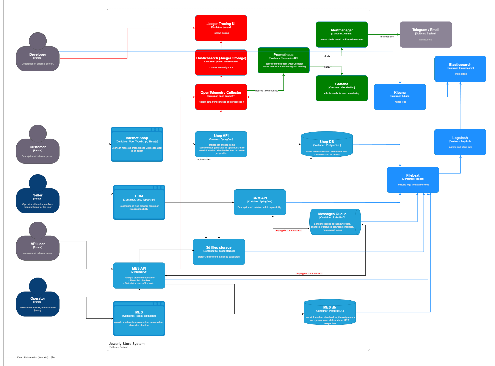

## Задание 4. Архитектурное решение по логированию

### Мотивация

Сейчас ошибки и нестандартные ситуации разбираются со слов клиента. Разработчики и специалисты поддержки тратят много времени на ручной поиск причин сбоев. Внедрение централизованного логирования позволит:

- Сократить время диагностики - вместо ручного просмотра логов каждого сервиса инженеры видят все события в одном месте с единым форматом.
- Снизить нагрузку на поддержку - клиенты перестанут быть единственным источником информации о сбоях.
- Автоматически выявлять аномалии - например, резкий рост ошибок или DDoS-атаку.
- Обеспечить соответствие требованиям - для аудита и расследования инцидентов.
- Обучать новых разработчиков - логи помогают быстрее вникать в систему.

Влияние на бизнес-метрики:

| Метрика                                    | Как изменится | Почему                                              |
|--------------------------------------------|---------------|-----------------------------------------------------|
| Среднее время восстановления (MTTR)        | Сократится    | Инженеры сразу видят ошибки и контекст              |
| Среднее время обнаружения инцидента (MTTD) | Сократится    | Логи позволяют быстрее заметить аномалии            |
| Скорость выпуска релизов                   | Увеличится    | Разработчики быстрее находят и исправляют ошибки    |
| Удовлетворённость клиентов (NPS/CSAT)      | Повысится     | Стабильная работа и быстрое реагирование            |
| Затраты на поддержку                       | Снизятся      | Инженеры тратят меньше времени на разбор инцидентов |
| Доля успешных расследований инцидентов     | Повысится     | Логи дают полную картину                            |
| Частота повторных инцидентов               | Снизится      | По логам можно найти корневую причину               |
| Финансовые потери от сбоев                 | Снизятся      | Меньше потерянных заказов                           |

### Анализ системы и планирование логирования

#### Какие логи собираем

Логи собираются со всех сервисов, участвующих в обработке заказа:

| Система      | Уровень | События                                                                                                 | Данные                                                     |
|--------------|---------|---------------------------------------------------------------------------------------------------------|------------------------------------------------------------|
| Shop API     | INFO    | Создание заказа (INITIATED), загрузка 3D-модели (FILE_UPLOADED), отправка заказа (SUBMITTED)            | order_id, user_id, timestamp, file_size, endpoint          |
|              | WARN    | Долгие запросы (> 1 сек), ошибки валидации 3D-файлов                                                    | order_id, duration, error_message                          |
|              | ERROR   | Ошибки при записи в БД или S3                                                                           | order_id, stack_trace                                      |
| CRM API      | INFO    | Получение заказа из очереди, обновление статуса (MANUFACTURING_APPROVED, CLOSED)                        | order_id, old_status, new_status, timestamp                |
|              | WARN    | Заказ в статусе > 3 дней                                                                                | order_id, status, days_in_status                           |
|              | ERROR   | Ошибки при работе с БД или очередью                                                                     | order_id, error_message                                    |
| MES API      | INFO    | Расчёт стоимости (PRICE_CALCULATED), назначение оператора (MANUFACTURING_STARTED), завершение (SHIPPED) | order_id, operator_id, polygon_count, calculation_duration |
|              | WARN    | Долгий расчёт (> 5 мин), низкая эффективность оператора                                                 | order_id, duration, operator_id                            |
|              | ERROR   | Ошибки расчёта, падение консьюмера                                                                      | order_id, error_message                                    |
| RabbitMQ     | INFO    | Отправка/получение сообщений, размер очереди                                                            | queue_name, message_id, timestamp                          |
|              | WARN    | Сообщение в DLQ, повторные попытки                                                                      | queue_name, reason                                         |
|              | ERROR   | Ошибка публикации/потребления                                                                           | queue_name, error                                          |
| Базы данных  | INFO    | Медленные запросы (> 200 мс), количество соединений                                                     | query, duration, db_instance                               |
|              | WARN    | Приближение к лимиту соединений                                                                         | connections, max_connections                               |
|              | ERROR   | Ошибки выполнения запросов                                                                              | query, error                                               |
| S3-хранилище | INFO    | Загрузка/скачивание файлов, размер                                                                      | file_name, size, timestamp                                 |
|              | WARN    | Приближение к лимиту хранилища (> 80%)                                                                  | used_size, total_size                                      |
|              | ERROR   | Ошибки доступа                                                                                          | file_name, error                                           |

#### Уровни логирования

- INFO - штатные операции: создание заказа, обновление статуса, расчёт стоимости, успешная отправка/получение сообщений.
- WARN - некритичные отклонения: долгие запросы, повторные попытки, заказы, зависшие в статусе > 3 дней, приближение к лимитам.
- ERROR - критические сбои: ошибки БД, падение консьюмера, ошибки расчёта, потеря сообщений.

#### Приоритеты внедрения

Команда не сможет реализовать логирование и трейсинг всех систем единовременно. Очередность:

1. Shop API и CRM API - именно здесь создаются и управляются заказы, первые жалобы клиентов.
2. MES API - сложный расчёт и интеграция с производством; логирование поможет выявить узкие места.
3. RabbitMQ и БД - логирование инфраструктуры на втором этапе (после настройки сбора логов с приложений).
4. S3-хранилище - на третьем этапе (при росте объёмов).

### Предлагаемое решение

#### 1. Инструменты

Для логирования выбираем стек ELK (Elasticsearch, Logstash, Kibana).  
Обоснование: В Задании 2 мы рассматривали Loki как легковесную альтернативу, но после детального анализа потребностей (полнотекстовый поиск по логам, сложные запросы для расследований, богатые дашборды для бизнеса) выбран ELK как более зрелое и функциональное решение. Команда имеет опыт работы с Elasticsearch, что снижает риски внедрения.

- Filebeat - лёгкий сборщик логов, устанавливается на каждый узел приложения; отправляет логи в Logstash.
- Logstash - центральный процессор для парсинга, фильтрации и обогащения логов.
- Elasticsearch - хранилище и поисковый движок.
- Kibana - визуализация, дашборды, поиск.

Примечание: Kafka как буфер между Filebeat и Logstash может быть добавлена на втором этапе при резком росте объёма логов (как опциональное улучшение), но в MVP не используется.

#### 2. Архитектура логирования

На диаграмме C4 добавляются компоненты (выделены синим):

- Filebeat - на каждом узле приложения для сбора логов.
- Logstash - центральный процессор.
- Elasticsearch - хранилище.
- Kibana - UI.

Новые связи:
- Каждый сервис → Filebeat (логи в структурированном JSON).
- Filebeat → Logstash.
- Logstash → Elasticsearch.
- Kibana → Elasticsearch.
- Инженеры → Kibana.

**Диаграмма:** 
[diagram_logging.drawio](Task4/diagram_logging.drawio)

#### 3. Интеграция с трейсингом

Логи содержат поля trace_id и span_id, передаваемые из OpenTelemetry. Это позволяет:
- В Kibana по trace_id найти все логи, относящиеся к одному запросу.
- В Jaeger UI кликнуть на трейс и перейти к соответствующим логам.

#### 4. Формат логов

Все логи должны быть в JSON с обязательными полями: timestamp, level, service, trace_id, span_id, order_id (если применимо), user_id, message. Дополнительные поля добавляются по необходимости.

#### 5. Политика безопасности

- Доступ к Kibana - через корпоративный SSO (LDAP/AD) с ролями: «Разработчик» (свои сервисы), «Поддержка» (поиск по заказам), «Администратор» (все настройки).
- Шифрование - TLS для передачи логов между агентами и Elasticsearch.
- Маскировка PII - перед записью в Elasticsearch фильтровать чувствительные данные (пароли, номера карт, телефоны) с помощью Logstash (регулярные выражения или плагин prune).
- Аудит доступа - логировать все запросы к Kibana.
- Защита от DDoS - ограничение частоты приёма логов на уровне Logstash/Filebeat.

#### 6. Политика хранения

- Индексы - отдельный индекс для каждой системы (например, shop-api-*, crm-api-*, mes-api-*).
- Срок хранения - 30 дней для «горячих» логов, затем перенос в холодное хранилище или удаление. Для бизнес-критичных логов (заказы) - 90 дней.
- Ротация - ежедневное создание новых индексов (например, shop-api-2025-01-01), удаление старых через ILM (Index Lifecycle Management).
- Размер - ориентировочно 1-5 ГБ в день на сервис при пиковой нагрузке; в среднем - меньше. Требуется запас для Elasticsearch (реплики + шарды).

#### 7. Анализ логов и алертинг

Настроить автоматические правила в Kibana (через Elastalert или Watcher):

| Условие                                                                    | Действие                         |
|----------------------------------------------------------------------------|----------------------------------|
| Ошибок ERROR > 10 за 1 минуту в любом сервисе                              | Оповещение в Telegram/Slack      |
| Медленные запросы (> 5 сек) > 5 за 1 минуту                                | Оповещение DevOps                |
| Аномальный рост количества заказов за 1 минуту (например, > 1000 от нормы) | Оповещение (возможна DDoS-атака) |
| Сообщение в DLQ RabbitMQ                                                   | Оповещение разработчикам         |
| Заказ в статусе MANUFACTURING_APPROVED > 3 дней                            | Оповещение продакт-менеджеру     |
| Отсутствие логов от сервиса более 5 минут                                  | Оповещение DevOps                |

Детекция аномалий - использовать встроенные механизмы машинного обучения Elastic Stack (Anomaly Detection).

### Дополнительное задание: критерии выбора технологии логирования

Ниже представлена таблица сравнения четырёх решений. Веса выбраны исходя из приоритетов компании: мощный поиск и удобный интерфейс критичны для быстрого анализа инцидентов; потребление ресурсов и стоимость важны при ограниченном бюджете.

| Критерий                    | Вес | ELK (Elastic) | OpenSearch | Loki (Grafana) | Splunk | Пояснение                                                                                                                                                                                                            |
|-----------------------------|-----|---------------|------------|----------------|--------|----------------------------------------------------------------------------------------------------------------------------------------------------------------------------------------------------------------------|
| Зрелость экосистемы         | 10  | 10            | 8          | 6              | 10     | ELK и Splunk — устоявшиеся решения с многолетней историей и большим сообществом. OpenSearch — форк ELK, развивается, но сообщество меньше. Loki — молодой продукт, экосистема растёт, но пока не так зрела.          |
| Мощный полнотекстовый поиск | 25  | 25            | 25         | 5              | 25     | ELK, OpenSearch и Splunk имеют мощный полнотекстовый поиск по всему содержимому логов. Loki использует индексацию только по меткам (labels), полнотекстовый поиск отсутствует — для расследований это критично.      |
| Удобный интерфейс           | 15  | 15            | 15         | 15             | 5      | Kibana (ELK) и OpenSearch Dashboard — интуитивно понятные, широкие возможности. Loki интегрируется с Grafana — отличный интерфейс, если команда уже использует Grafana. Splunk UI устарел и менее удобен.            |
| Потребление ресурсов        | 15  | 5             | 5          | 15             | 5      | ELK и OpenSearch требуют много памяти и CPU из-за индексации. Loki — легковесный, хранит логи в сжатом виде и использует минимальные ресурсы. Splunk — тяжёлый, требуется мощное железо.                             |
| Затраты на приобретение     | 10  | 5             | 10         | 10             | 2      | ELK — условно бесплатный, но есть платные функции (Elastic License). OpenSearch — полностью Open Source (Apache 2.0). Loki — Open Source (AGPLv3). Splunk — дорогая проприетарная лицензия.                          |
| Затраты на эксплуатацию     | 10  | 5             | 5          | 10             | 3      | ELK и OpenSearch требуют постоянного администрирования (настройка шардов, ILM, обновления). Loki проще в эксплуатации — меньше компонентов. Splunk дорогой в обслуживании и требует лицензирования по объёму данных. |
| Наличие поддержки           | 5   | 5             | 3          | 3              | 5      | У ELK и Splunk есть коммерческая поддержка и огромное сообщество. OpenSearch и Loki в основном полагаются на сообщество, поддержка от вендоров ограничена.                                                           |
| Документация                | 5   | 5             | 3          | 3              | 5      | У ELK и Splunk — обширная, зрелая документация. OpenSearch и Loki имеют хорошую, но менее полную документацию.                                                                                                       |
| Лицензия                    | 5   | 3             | 5          | 5              | 2      | OpenSearch и Loki — Open Source (Apache 2.0 / AGPLv3). ELK — Elastic License, часть функций платная. Splunk — полностью проприетарная, требует покупки лицензии.                                                     |
| Итого                       | 100 | 78            | 79         | 72             | 62     |                                                                                                                                                                                                                      |

Выбор: OpenSearch набрал 79 баллов, ELK — 78, Loki — 72, Splunk — 62. Несмотря на минимальное отставание от OpenSearch (всего 1 балл), ELK выбран благодаря:
- Зрелости экосистемы и наличию экспертизы в команде (разработчики уже работали с Elasticsearch).
- Более богатому функционалу для сложных расследований (агрегации, ML-модули).
- Широкому набору интеграций с существующими системами.

OpenSearch — близкая альтернатива, но отсутствие опыта команды и меньшая зрелость делают его более рискованным. Loki проигрывает из-за отсутствия полнотекстового поиска, что критично для детального анализа инцидентов. Splunk отсеян из-за высокой стоимости и проприетарной лицензии.