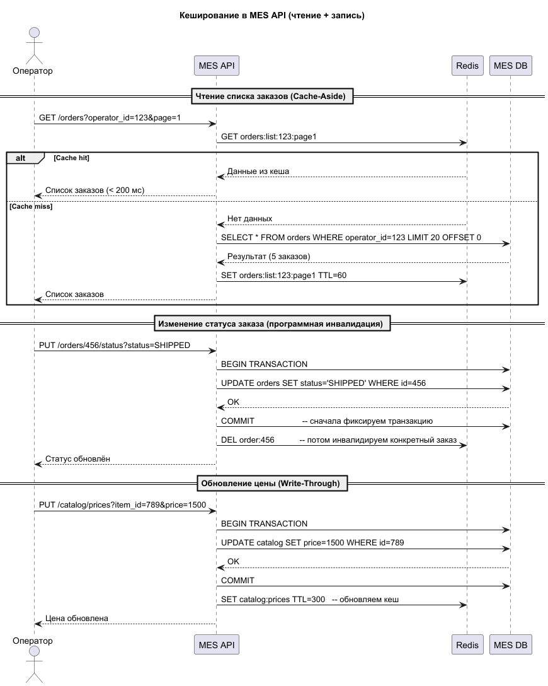

## Задание 5. Кеширование

### Мотивация

Операторы MES жалуются на низкую скорость работы со страницей списка заказов (дашборд). Расчёт стоимости заказа длится 2–30 минут. Это приводит к недовольству клиентов и операторов, снижению производительности труда и потере заказов. Кеширование позволит:

- Ускорить загрузку дашборда MES за счёт кеширования часто запрашиваемых списков заказов (с 5+ секунд до < 200 мс).
- Снизить нагрузку на БД MES, особенно на операции чтения (ожидаемое снижение на 70–80%).
- Сократить время отклика для повторяющихся запросов (статусы заказов, списки по операторам).
- Уменьшить количество дорогих расчётов (кеширование уже рассчитанной стоимости для повторных запросов).
- Повысить удовлетворённость клиентов и операторов за счёт более быстрой работы системы.

### Предлагаемое решение

#### 1. Инструменты и подход

Используем серверное кеширование с комбинацией двух технологий:

| Технология          | Где применяем                                                                                                                  | Почему                                                                                                               |
|---------------------|--------------------------------------------------------------------------------------------------------------------------------|----------------------------------------------------------------------------------------------------------------------|
| Redis               | Распределённые данные (списки заказов, конкретные заказы, результаты расчёта, справочники, используемые несколькими сервисами) | Централизованное хранение, горизонтальное масштабирование (Redis Cluster), высокая производительность, поддержка TTL |
| RAM-кеш (in-memory) | Данные, используемые только внутри MES и требующие максимальной скорости (спецификации, статусы оборудования, очередь заказов) | Минимальная задержка (без сетевых вызовов), простота реализации для локальных данных                                 |

Почему не клиентское кеширование: Клиентское кеширование (HTTP-заголовки, CDN) не снижает нагрузку на БД и не решает проблему медленных запросов к серверу. Оно подходит только для статического контента, но не для динамических API-запросов.

#### 2. Паттерны кеширования

Используем два паттерна в зависимости от типа данных:

| Паттерн                              | Где применяем                                                                   | Описание                                                                                        |
|--------------------------------------|---------------------------------------------------------------------------------|-------------------------------------------------------------------------------------------------|
| Cache-Aside (основной)               | Списки заказов, конкретный заказ, результат расчёта, номенклатура, спецификации | При запросе проверяем кеш → при промахе читаем из БД → сохраняем в кеш с TTL                    |
| Write-Through (для критичных данных) | Цены номенклатуры, остатки номенклатуры, статус оборудования, очередь заказов   | При записи обновляем БД и кеш одновременно → гарантирует актуальность данных сразу после записи |

Почему не другие паттерны:

| Паттерн       | Описание                                     | Почему не подходит                                      |
|---------------|----------------------------------------------|---------------------------------------------------------|
| Read-Through  | Кеш сам читает из БД при промахе             | Требует кастомной реализации, избыточно для Cache-Aside |
| Write-Behind  | Запись сначала в кеш, потом асинхронно в БД  | Риск потери данных при сбое, сложность реализации       |
| Refresh-Ahead | Асинхронное обновление кеша до истечения TTL | Сложная реализация, требует прогнозирования нагрузки    |

#### 3. Кешируемые сущности и TTL

| Сущность                        | Где хранится    | Паттерн       | TTL       | Ключ                             | Обоснование                                                                              |
|---------------------------------|-----------------|---------------|-----------|----------------------------------|------------------------------------------------------------------------------------------|
| Список заказов для дашборда MES | Redis           | Cache-Aside   | 60 с      | orders:list:{operator_id}:{page} | Самый частый запрос, допустима небольшая задержка (1 мин). Инвалидируется только по TTL. |
| Конкретный заказ по ID          | Redis           | Cache-Aside   | 60 с      | order:{order_id}                 | Часто запрашивается для деталей, инвалидируется при изменении статуса.                   |
| Результат расчёта стоимости     | Redis           | Cache-Aside   | 7 дней    | price:order:{order_id}           | Расчёт дорогой (2–30 мин), после расчёта не меняется (только если меняется 3D‑модель).   |
| Номенклатура (товары/услуги)    | Redis           | Cache-Aside   | 30–60 мин | catalog:nomenclature             | Редко меняется, много запросов из разных сервисов.                                       |
| Цены номенклатуры               | Redis           | Write-Through | 5–15 мин  | catalog:prices                   | Критичны для расчётов, меняются нечасто, должны быть актуальными.                        |
| Остатки номенклатуры            | Redis           | Write-Through | 1–5 мин   | catalog:stock                    | Часто меняются, критичны для расчётов, допустима небольшая задержка (до 5 мин).          |
| Спецификации (производственные) | RAM (in-memory) | Cache-Aside   | 2–5 часов | Внутренняя карта                 | Используются только в MES, редко меняются, максимальная скорость.                        |
| Статус оборудования             | RAM (in-memory) | Write-Through | 1–2 мин   | Внутренняя карта                 | Часто меняется, критичен для расчётов, минимальная задержка.                             |
| Очередь заказов на расчёт       | RAM (in-memory) | Write-Through | 1–2 мин   | Внутренняя карта                 | Меняется постоянно, нужна максимальная скорость для операторов.                          |

#### 4. Стратегия инвалидации кеша

Используем гибридную стратегию (TTL + программная инвалидация):

- TTL (временная) — для всех кешируемых данных как страховка.
- Программная инвалидация — при обновлении данных удаляются соответствующие ключи:

| Действие                             | Инвалидируемые ключи                                   |
|--------------------------------------|--------------------------------------------------------|
| Изменение статуса заказа             | order:{order_id} (списки инвалидируются только по TTL) |
| Изменение цены/остатка               | catalog:prices, catalog:stock                          |
| Пересчёт стоимости (новая 3D-модель) | price:order:{order_id}                                 |
| Изменение номенклатуры               | catalog:nomenclature                                   |

Для Write-Through инвалидация не требуется — кеш обновляется одновременно с БД.

Сравнение стратегий:

| Стратегия                  | Плюсы                                 | Минусы                                                 |
|----------------------------|---------------------------------------|--------------------------------------------------------|
| Только TTL                 | Простота, автоматическая очистка      | Данные могут быть устаревшими до истечения TTL         |
| Только программная         | Более актуальные данные               | Сложность отслеживания всех зависимостей (списки)      |
| Гибрид (TTL + программная) | Лучший баланс актуальности и простоты | Чуть сложнее в реализации                              |
| Write-Through              | Гарантированная актуальность          | Дополнительная задержка при записи                     |

Выбираем гибрид + Write-Through для критичных данных.

#### 5. Диаграмма последовательности (Sequence Diagram)
[sequece_diagram.puml](sequece_diagram.puml)

#### 6. Сравнение альтернативных решений (дополнительное задание)

| Критерий                         | Решение 1 (Redis + Cache-Aside) | Решение 2 (HTTP-кеширование)      | Решение 3 (CDN)         |
|----------------------------------|---------------------------------|-----------------------------------|-------------------------|
| Снижение нагрузки на БД          | Да, значительно                 | Нет (запрос всё равно до сервера) | Не применимо к API      |
| Ускорение ответа                 | < 10 мс (in-memory)             | Умеренное (зависит от сети)       | Только для статики      |
| Гибкая инвалидация               | Да (TTL + программная)          | Только по времени (max-age)       | Не управляется          |
| Сложность реализации             | Средняя (нужен Redis)           | Низкая (заголовки)                | Средняя (настройка CDN) |
| Подходит для динамических данных | Отлично                         | Плохо                             | Не применимо            |
| Горизонтальное масштабирование   | Да (Redis Cluster)              | Да (балансировка)                 | Да (CDN)                |
| Поддержка распределённого кеша   | Да                              | Нет                               | Нет                     |

Заключение: Решение 1 (Redis + Cache-Aside) — наилучший выбор, так как оно напрямую решает проблему нагрузки на БД и даёт максимальное ускорение для динамических данных. Решение 2 (HTTP-кеширование) не снижает нагрузку на БД, а лишь экономит сетевой трафик. Решение 3 (CDN) применимо только к статическим ресурсам, но не к API-запросам.
